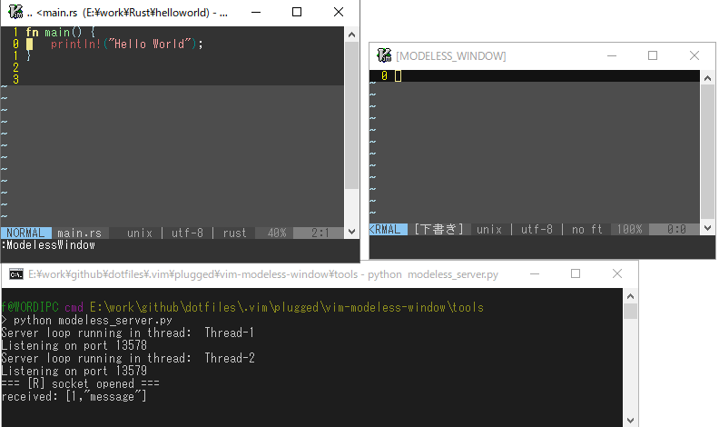

# vim-modeless-window

Modeless window by other vim.

*Only gvim supported.*

# Demo




# Installing

For [vim-plug](https://github.com/junegunn/vim-plug), or 

```vim
Plug 'wordijp/vim-modeless-window'
```

# How to use

- 1: run python server from command prompt.

```
> python tools/modeless_server.py
```

- 2: call `ModelessWindow` command

- 3: call `modeless_window#send(txt)` " txt: array(string)

For example, if you want to use [thinca/vim-quickrun](https://github.com/thinca/vim-quickrun) in Rust, use this hook.

setup .vimrc


```vim
" .vimrc

let g:quickrun_config = {
\  'rust-run-modeless': {
\    'command' : 'cargo',
\    'cmdopt': 'run',
\    'args': '--quiet',
\    'exec' : '%c %o %a',
\    'outputter': 'buffer',
\    'outputter/buffer/close_on_empty': 1,
\  },
\ }

let s:hook = {
\ 'name': 'modeless',
\ 'kind': 'hook',
\ 'output_data': '',
\ }

function! s:hook.on_output(data, session)
  let self.output_data .= a:session.data
  let a:session.data = '' " empty output
endfunction

function! s:hook.on_exit(session, context)
  let l:txt = split(self.output_data, '\r\n\|\n')
  call modeless_window#send(l:txt)

  echohl MoreMsg
  echomsg 'output: to modeless'
  echohl NONE
endfunction

call quickrun#module#register(s:hook, 1)
unlet s:hook

```

and run

```
:QuickRun rust-run-modeless
```

# Dependencies

- [Shougo/vimproc](https://github.com/Shougo/vimproc.vim)

# License

MIT
